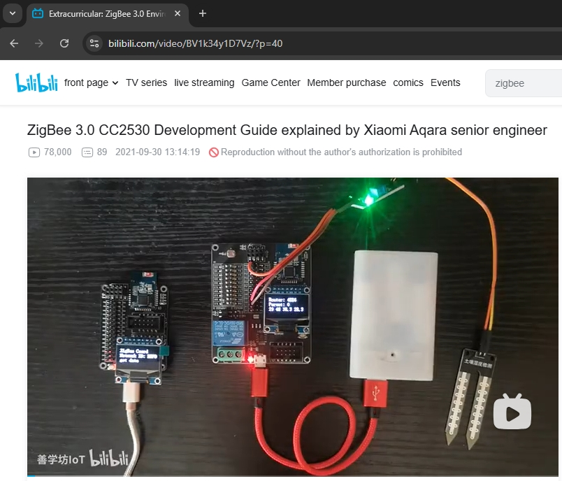
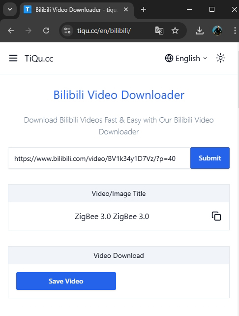
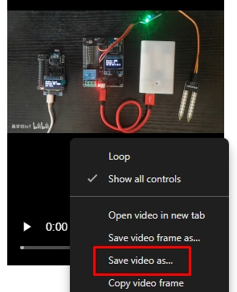

URL: https://github.com/mozolin/ZigBee_3.0_Development_Guide  

# ZigBee 3.0 Development Guide
Translated by Mike Mozolin using Google Translate  
(started in August 2024)  
Original (Chinese): [https://z7po9bxpe4.k.topthink.com/@zigbee-dev-guide/](https://z7po9bxpe4.k.topthink.com/@zigbee-dev-guide/)  
  
## Files & Folders

- [**src/ZigBee_3.0_Dev_Guide**](src/ZigBee_3.0_Dev_Guide): all sources (.docx & images) for the final document  
- [**videos**](videos): all videos from Chinese resource  
- [**zigbee-src.zip**](zigbee-src.zip): all source texts and documents from Chinese resource  
- [**ZigBee_3.0_Development_Guide-Part1.pdf**](ZigBee_3.0_Development_Guide-Part1.pdf): the final document, part 1  
- [**ZigBee_3.0_Development_Guide-Part2.pdf**](ZigBee_3.0_Development_Guide-Part2.pdf): the final document, part 2  

## Contents
* **1. Course Description**
* **2. Download supporting resources**
* **3. Development Kit Introduction**
  * 3.1. Introduction
  * 3.2. Hardware composition & technical parameters
  * 3.3. Circuit Schematic & PCB Diagram - Standard Board
  * 3.4. Circuit Schematic & PCB Diagram - MiNi Board
  * 3.5. CC2530F256 module specifications
  * 3.6. WiFi module specifications
  * 3.7. Communication distance test
* **4. Part 1: Preparation**
  * 4.1. Introduction to ZigBee 3.0 that even a novice can understand
  * 4.2. IAR EW for 8051 Introduction and Installation
  * 4.3. TI Z-Stack 3.0 Introduction and Installation
  * 4.4. SmartRF Flash Programmer Download and Installation
  * 4.5. Serial Port Assistant Introduction and Installation
  * 4.6. SmartRF04EB Driver
  * 4.7. USB to Serial Port Driver
  * 4.8. Other software installation (optional)
    * 4.8.1. Xshell 7 Introduction and Installation Guide
    * 4.8.2. PuTTY Introduction and Installation
* **5. Part 2: Introduction to 51 MCU - Based on CC2530**
  * 5.1. Chapter 1: CC2530 Development Basic Experiment
    * 5.1.1. Create a new workspace and project
    * 5.1.2. Source code writing and compilation
    * 5.1.3. Program download and simulation
    * 5.1.4. Firmware Burning
  * 5.2. Chapter 2: GPIO Experiment
    * 5.2.1. Multi-project management foundation
    * 5.2.2. GPIO output experiment - LED control
    * 5.2.3. GPIO input experiment - mechanical buttons
    * 5.2.4. GPIO input and output general configuration experiment
    * 5.2.5. GPIO external interrupt experiment
  * 5.3. Chapter 3: Timer Experiment
    * 5.3.1. Project Overview
    * 5.3.2. Timer T1 Experiment - Query Trigger
    * 5.3.3. Timer T3 Experiment - Interrupt Trigger
    * 5.3.4. Watchdog Timer Experiment
    * 5.3.5. Low Power Timer Experiment
  * 5.4. Chapter 4: Serial Communication Experiment
  * 5.5. Chapter 5: ADC Experiment - Using the Light Sensor
  * 5.6. Chapter 6: OLED Display Experiment
  * 5.7. Chapter 7: Peripheral Experiments
    * 5.7.1. DHT11 Temperature and Humidity Sensor
    * 5.7.2. NorFLASH reading and writing experiment
    * 5.7.3. Relay Control Experiment
* **6. Part 3: Z-Stack 3.0 Detailed Explanation**
  * 6.1. Chapter 1: Detailed Explanation of Z-Stack 3.0 Architecture
    * 6.1.1. Z-Stack 3.0.1 File Organization
    * 6.1.2. Z-Stack 3.0.1 Project Framework
  * 6.2. Chapter 2: Task Scheduling Principles of Operating Systems
  * 6.3. Chapter 3: OSAL Detailed Explanation
    * 6.3.1. OSAL Task Scheduling Principle
    * 6.3.2. Task initialization and event processing
    * 6.3.3. Application of Z-Stack Events
    * 6.3.4. Using Dynamic Memory
  * 6.4. Chapter 4: Hardware Adaptation Layer Application - LED
    * 6.4.1. HAL file structure and project structure
    * 6.4.2. HAL Architecture Overview
    * 6.4.3. Introduction to LED API
    * 6.4.4. LED Experiment
  * 6.5. Chapter 5: Hardware Adaptation Layer Application - Buttons
    * 6.5.1 Keystroke Experiment
    * 6.5.2 Detailed Explanation of HAL Key Framework (Optional)
  * 6.6. Chapter 6: Hardware Adaptation Layer Application - Serial Port
  * 6.7. Chapter 7: Hardware Adaptation Layer Application - Display Screen
  * 6.8. Chapter 8: Hardware Adaptation Layer Application - ADC
* **7. Part 4: ZigBee 3.0 Network Programming**
  * 7.2. Chapter 1: ZigBee 3.0 Network Principles
    * 7.1.1. Protocol Hierarchy
    * 7.1.2. IEEE 802.15.4 Protocol
    * 7.1.3. Network Layer
  * 7.2. Chapter 2: ZigBee 3.0 BDB
    * 7.2.1. Introduction to BDB
    * 7.2.2. BDB Commissioning Modes
    * 7.2.3. ZigBee 3.0 Networking Experiment
  * 7.3. Chapter 3: Data Communication Based on AF
    * 7.3.1. Simple Descriptor
    * 7.3.2. Communication Principle
    * 7.3.3. Introduction to Data Sending API
    * 7.3.4. ZigBee 3.0 Communication Experiment
  * 7.4. Chapter 4: ZCL Basic Principles
    * 7.4.1. Introduction to ZCL
    * 7.4.2. Detailed explanation of ZCL content
  * 7.5. Chapter 5: Switch command transmission and reception based on ZCL
    * 7.5.1. Application layer calls ZCL API
    * 7.5.2. ZCL switch command sending and receiving API
    * 7.5.3. ZCL switch command sending and receiving experiment
  * 7.6. Chapter 6: Attribute reading and writing based on ZCL
    * 7.6.1. ZCL attribute read and write API
    * 7.6.2. ZCL attribute reading and writing experiment
  * 7.7. Chapter 7: Attribute reporting experiment based on ZCL
    * 7.7.1. Overview
    * 7.7.2. Terminal Equipment Development
    * 7.7.3. Coordinator Device Development
    * 7.7.4. Simulation Debugging
* **8. Extracurricular: Project Practice**
  * 8.1. ZigBee 3.0 Environmental Information Collection (1)
    * 8.1.1. System Introduction
    * 8.1.2. Source code download
    * 8.1.3. Hardware List
    * 8.1.4. System Construction
    * 8.1.5. Source code description
  * 8.2. ZigBee 3.0 Environmental Information Collection (2)
    * 8.2.1. System Introduction
    * 8.2.2. Source code download
    * 8.2.3. Hardware List
    * 8.2.4. Using Tencent Cloud
    * 8.2.5. Download and install MQTT.fx
    * 8.2.6. MQTT.fx connects to Tencent Cloud
    * 8.2.7. MQTT.fx publishes messages
    * 8.2.8. Configuring the Development Board
    * 8.2.9. Burn the coordinator firmware
    * 8.2.10. Burning Router Firmware
    * 8.2.11. Source code description
  * 8.3. ZigBee Temperature and Humidity Monitoring & Sound and Light Alarm System (1)
    * 8.3.1. System Introduction
    * 8.3.2. Source code download
    * 8.3.3. Hardware List
    * 8.3.4. System Construction
    * 8.3.5. Source code description
  * 8.4. ZigBee automatic light on - based on light intensity & human body monitoring (1)
    * 8.4.1. System Introduction
    * 8.4.2. Source code download
    * 8.4.3. Hardware List
    * 8.4.4. System Construction
    * 8.4.5. Source code description
  * 8.5. File transmission system based on ZigBee
  * 8.6. ZigBee-based automatic curtain opening and closing
  * 8.7. ZigBee-based temperature, humidity & light intensity acquisition system
  * 8.8. Agricultural environmental information collection based on ZigBee
    * 8.8.1. System Introduction
    * 8.8.2. Source code download
    * 8.8.3. Hardware List
    * 8.8.4. Using a private cloud server
    * 8.8.5. Configuring the Development Board
    * 8.8.6. Networking and WiFi Connection
    * 8.8.7. Using Android APP
    * 8.8.8. Source code description
  * 8.9. Common problems in project construction
* **9. Extracurricular: Advanced Electives**
  * 9.1. Description of "Extracurricular: Advanced Elective"
  * 9.2. Chapter 1: Serial Communication Protocol Design
    * 9.2.1. Design basis
    * 9.2.2. Protocol Format
  * 9.3. Chapter 2: Optimizing the Coordinator Project Structure
    * 9.3.1. Project Structure
    * 9.3.2. Detailed explanation of application framework
      * 9.3.2.1. Framework Description
      * 9.3.2.2. zbmsg
      * 9.3.2.3. zbcategory
  * 9.4. Chapter 3: Coordinator host computer debugging
    * 9.4.1. Host computer description
    * 9.4.2. Debugging Instructions
  * 9.5. Chapter 4: Dynamic Modification of Channels and PanId
    * 9.5.1. Serial Port Protocol
    * 9.5.2. Important interface description
      * 9.5.2.1. NIB
      * 9.5.2.2. NLME_UpdateNV
    * 9.5.3. Architecture Adjustment
    * 9.5.4. Application
      * 9.5.4.1. zbnwk interface implementation
      * 9.5.4.2. Serial communication analysis
      * 9.5.4.3. Burning and debugging
  * 9.6. Chapter 5: Obtaining Network Short Address and MAC Address
    * 9.6.1. Interface Description
      * 9.6.1.1. Description
      * 9.6.1.2. Calling Process
      * 9.6.1.3. Asynchronous Data
    * 9.6.2. Debugging
  * 9.7. Chapter 6: Network Access Control and Whitelist
    * 9.7.1. Basic content
      * 9.7.1.1. Network access control
      * 9.7.1.2. Whitelist
    * 9.7.2. Function Encapsulation
    * 9.7.3. Program Debugging
  * 9.8. Chapter 7: Coordinator Partition Storage Management
    * 9.8.1. Software Framework
    * 9.8.2. Application
    * 9.8.3. Debugging
  * 9.9. ZigBee 2 WiFi - Based on ESP8266
    * 9.9.1. Use cloud server
    * 9.9.2. Source code description and testing
  * 9.10. Capturing and analyzing ZigBee wireless messages
  * 9.11. Connect to Xiaomi Aqara smart socket and temperature and humidity sensor
  * 9.12. NV Application of Z-Stack
    * 9.12.1. Introduction to NV
    * 9.12.2. NV reading and writing
  * 9.13. HAL-based external FLASH application
  * 9.14. TFT display experiment (optional)
  * 9.15. Lighting project source code analysis
    * 9.15.1. ZHA Lighting Project
    * 9.15.2. ZHA Lighting source code analysis
    * 9.15.3. Lighting brightness adjustment experiment
  * 9.16. TemperatureSensor project source code analysis
    * 9.16.1. ZHA TemperatureSensor Project
    * 9.16.2. ZHA TemperatureSensor Source Code Analysis
  * 9.17. Other extracurricular projects
    * 9.17.1. Temperature and harmful gas SMS alarm system based on ZigBee
    * 9.17.2. Multi-sensor detection and lighting alarm system based on ZigBee
    * 9.17.3. Temperature, humidity, human infrared and sound and light alarm system based on ZigBee
    * 9.17.4. ZigBee 3.0 multi-node networking practice
    * 9.17.5. Temperature, humidity & signal strength detection system based on ZigBee
  * 9.18. IAR EW for 8051 FAQ & Solutions

[Bilibili Video Downloader](https://tiqu.cc/ru/bilibili/)  
  
  
  

[Development board on Taobao](https://item.taobao.com/item.htm?id=683089996879)  
[Development board on Aliexpress](https://aliexpress.ru/item/1005003309355639.html)  
